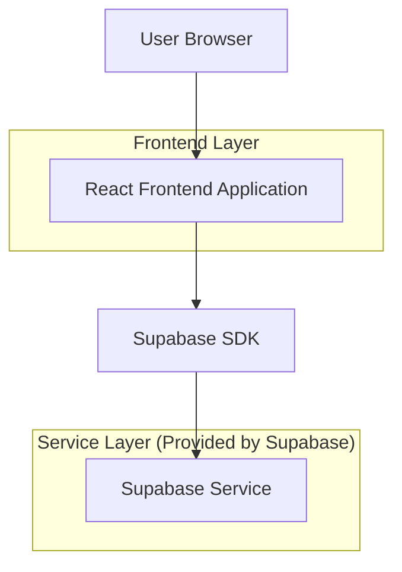
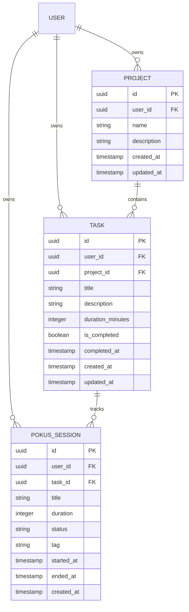

# Technical Architecture Document - Pokus Project Management

## 1. Architecture Design



## 2. Technology Description

- **Frontend**: React@18 + tailwindcss@3 + vite + react-router@6
- **Backend**: Supabase (PostgreSQL, Auth, Storage)
- **State Management**: React Context + Local Storage (for offline support)
- **Icons**: lucide-react
- **PWA**: Service worker for offline support

## 3. Route Definitions

| Route | Purpose | Access |
|-------|---------|--------|
| `/` | Projects list (main landing) | Authenticated |
| `/history` | Session history | Authenticated |
| `/projects` | Projects list | Authenticated |
| `/projects/:id` | Project detail page with tasks | Authenticated |
| `/focus` | Focus timer page with optional task selection | Public |
| `/focus/:id` | Active focus session detail page | Public |
| `/login` | Login/Register page using Supabase Auth | Public |

## 4. API Definitions

### 4.1 Projects API

```typescript
interface Project {
  id: string;
  user_id: string;
  name: string;
  description: string;
  created_at: string;
  updated_at: string;
}

interface ProjectWithTasks extends Project {
  tasks: Task[];
  total_tasks: number;
  completed_tasks: number;
  total_duration: number;
}

// Create a new project
async function createProject(name: string, description: string): Promise<Project>

// Get all projects for current user
async function getProjects(): Promise<Project[]>

// Get single project by ID
async function getProject(id: string): Promise<Project | null>

// Get project with tasks and time stats
async function getProjectWithTasks(id: string): Promise<ProjectWithTasks>

// Update project
async function updateProject(id: string, data: Partial<Pick<Project, "name" | "description">>): Promise<Project>

// Delete project
async function deleteProject(id: string): Promise<void>
```

### 4.2 Tasks API

```typescript
interface Task {
  id: string;
  user_id: string;
  project_id: string;
  title: string;
  description: string;
  duration_minutes: number;
  is_completed: boolean;
  completed_at: string | null;
  created_at: string;
  updated_at: string;
}

interface TaskWithProject extends Task {
  project_name: string;
}

// Create a new task
async function createTask(projectId: string, title: string, description: string): Promise<Task>

// Get all tasks for a project
async function getTasksByProject(projectId: string): Promise<Task[]>

// Get all incomplete tasks with project info (for Focus page)
async function getAllTasks(): Promise<TaskWithProject[]>

// Get single task by ID
async function getTask(id: string): Promise<Task | null>

// Update task
async function updateTask(id: string, data: Partial<Pick<Task, "title" | "description" | "duration_minutes" | "is_completed">>): Promise<Task>

// Delete task
async function deleteTask(id: string): Promise<void>

// Toggle task completion
async function toggleTaskComplete(id: string): Promise<Task>
```

### 4.3 Sessions API (Enhanced)

```typescript
interface LocalSession {
  id: string;
  title: string;
  duration: number;
  status: "PLANNED" | "IN_PROGRESS" | "COMPLETED" | "ABANDONED";
  tags: string[];
  task_id?: string;
  started_at?: string;
  ended_at?: string;
  created_at: string;
  user_id: string;
  syncStatus: "SYNCED" | "PENDING" | "FAILED";
  lastSyncedAt?: string;
}

// Create session with optional task
async function createSession(
  title: string, 
  duration: number, 
  tags: string[] = [], 
  taskId?: string
): Promise<LocalSession>

// Update session status
async function updateSessionStatus(
  sessionId: string,
  status: "COMPLETED" | "ABANDONED",
  actualDuration?: number
): Promise<void>

// Get sessions for date range
async function getSessions(startDate: Date, endDate: Date): Promise<LocalSession[]>
```

## 5. Server Architecture Diagram

Not applicable - using Supabase as backend service directly from frontend.

## 6. Data Model

### 6.1 Data Model Definition



### 6.2 Data Definition Language

#### Projects Table (projects)

```sql
-- Create projects table
CREATE TABLE projects (
    id UUID PRIMARY KEY DEFAULT gen_random_uuid(),
    user_id UUID REFERENCES auth.users(id) ON DELETE CASCADE NOT NULL,
    name VARCHAR(255) NOT NULL,
    description TEXT DEFAULT '',
    created_at TIMESTAMP WITH TIME ZONE DEFAULT NOW(),
    updated_at TIMESTAMP WITH TIME ZONE DEFAULT NOW()
);

-- Create index for user_id
CREATE INDEX idx_projects_user_id ON projects(user_id);

-- Enable RLS
ALTER TABLE projects ENABLE ROW LEVEL SECURITY;

-- RLS Policies
CREATE POLICY "Users can view own projects" ON projects
    FOR SELECT USING (auth.uid() = user_id);

CREATE POLICY "Users can insert own projects" ON projects
    FOR INSERT WITH CHECK (auth.uid() = user_id);

CREATE POLICY "Users can update own projects" ON projects
    FOR UPDATE USING (auth.uid() = user_id);

CREATE POLICY "Users can delete own projects" ON projects
    FOR DELETE USING (auth.uid() = user_id);

-- Grant permissions
GRANT SELECT, INSERT, UPDATE, DELETE ON projects TO authenticated;
```

#### Tasks Table (tasks)

```sql
-- Create tasks table
CREATE TABLE tasks (
    id UUID PRIMARY KEY DEFAULT gen_random_uuid(),
    user_id UUID REFERENCES auth.users(id) ON DELETE CASCADE NOT NULL,
    project_id UUID REFERENCES projects(id) ON DELETE CASCADE NOT NULL,
    title VARCHAR(255) NOT NULL,
    description TEXT DEFAULT '',
    duration_minutes INTEGER DEFAULT 0,
    is_completed BOOLEAN DEFAULT FALSE,
    completed_at TIMESTAMP WITH TIME ZONE,
    created_at TIMESTAMP WITH TIME ZONE DEFAULT NOW(),
    updated_at TIMESTAMP WITH TIME ZONE DEFAULT NOW()
);

-- Create indexes
CREATE INDEX idx_tasks_user_id ON tasks(user_id);
CREATE INDEX idx_tasks_project_id ON tasks(project_id);

-- Enable RLS
ALTER TABLE tasks ENABLE ROW LEVEL SECURITY;

-- RLS Policies
CREATE POLICY "Users can view own tasks" ON tasks
    FOR SELECT USING (auth.uid() = user_id);

CREATE POLICY "Users can insert own tasks" ON tasks
    FOR INSERT WITH CHECK (auth.uid() = user_id);

CREATE POLICY "Users can update own tasks" ON tasks
    FOR UPDATE USING (auth.uid() = user_id);

CREATE POLICY "Users can delete own tasks" ON tasks
    FOR DELETE USING (auth.uid() = user_id);

GRANT SELECT, INSERT, UPDATE, DELETE ON tasks TO authenticated;
```

#### Update pokus_sessions Table

```sql
-- Add task_id column to pokus_sessions
ALTER TABLE pokus_sessions
ADD COLUMN task_id UUID REFERENCES tasks(id) ON DELETE SET NULL;

-- Rename duration_planned to duration
ALTER TABLE pokus_sessions RENAME COLUMN duration_planned TO duration;

-- Drop the old duration_actual column
ALTER TABLE pokus_sessions DROP COLUMN IF EXISTS duration_actual;

-- Create index for task_id
CREATE INDEX idx_pokus_sessions_task_id ON pokus_sessions(task_id);

-- Create index for user_id + created_at (for time stats queries)
CREATE INDEX idx_pokus_sessions_user_created ON pokus_sessions(user_id, created_at DESC);

-- Grant permissions
GRANT UPDATE ON pokus_sessions TO authenticated;
```

## 7. Frontend Component Structure

```
src/
├── api/
│   ├── auth.ts              # Authentication (login, logout, signup)
│   ├── focus.ts             # Focus session operations
│   └── projects.ts          # Project & Task CRUD operations
├── components/
│   └── ui/                  # UI components (Button, Input, Modal)
│   └── features/
│       ├── CircularDurationInput.tsx  # Timer input
│       ├── TagSelector.tsx            # Tag selection
│       └── timer.ts                    # Timer component
├── hooks/
│   └── useAuth.ts           # Authentication hook
├── lib/
│   ├── supabase/
│   │   └── client.ts        # Supabase client
│   └── sync/
│       ├── db.ts            # IndexedDB for offline
│       ├── index.ts         # Sync utilities
│       └── sync.ts          # Sync logic
├── pages/
│   ├── HomePage.tsx         # Landing page
│   ├── LoginPage.tsx       # Login/Register
│   ├── FocusPage.tsx        # Focus timer setup with task selector
│   ├── FocusDetailPage.tsx  # Active focus session
│   ├── ProjectsPage.tsx     # Projects list (main landing)
│   ├── ProjectDetailPage.tsx # Project with tasks
│   └── DashboardPage.tsx    # Session history (/history)
├── router.tsx               # Route definitions
└── App.tsx                  # App entry
```

## 8. Key Implementation Details

### 8.1 Task Selector Enhancement

The Focus page task selector was enhanced to handle many tasks:

```typescript
// Search functionality - filters by task title AND project name
const filteredTasks = useMemo(() => {
  if (!taskSearch.trim()) return tasks;
  const search = taskSearch.toLowerCase();
  return tasks.filter((t) => 
    t.title.toLowerCase().includes(search) || 
    t.project_name.toLowerCase().includes(search)
  );
}, [tasks, taskSearch]);

// getAllTasks fetches task with project info via Supabase join
const { data } = await supabase
  .from("tasks")
  .select(`
    *,
    projects:project_id (name)
  `)
  .eq("user_id", user.id)
  .eq("is_completed", false);
```

### 8.2 Offline Support

- IndexedDB version incremented to 3 for schema migration
- Sessions migrated from `duration_planned` to `duration`
- Task ID support added to local session storage

### 8.3 URL Structure Changes

- Root `/` now points to Projects page (authenticated)
- Dashboard moved to `/history`
- All navigation links updated accordingly

## 9. Integration Points

### Focus Page Integration

The Focus page:
1. Checks if user is authenticated
2. If authenticated, fetches available tasks via `getAllTasks()`
3. Displays enhanced task selector dropdown with search
4. Shows project name as tag for each task
5. Passes selected task_id to createSession function

### Login Flow

After successful login:
1. Redirects to `/history` (session history)
2. User can navigate to Projects via nav links
3. Projects page is the main landing at `/`

## 10. Dependencies

```json
{
  "dependencies": {
    "react": "^18",
    "react-dom": "^18",
    "react-router": "^6",
    "supabase-js": "^2",
    "lucide-react": "^0.400",
    "idb": "^8",
    "zustand": "^4",
    "tailwindcss": "^3",
    "vite": "^6"
  }
}
```
