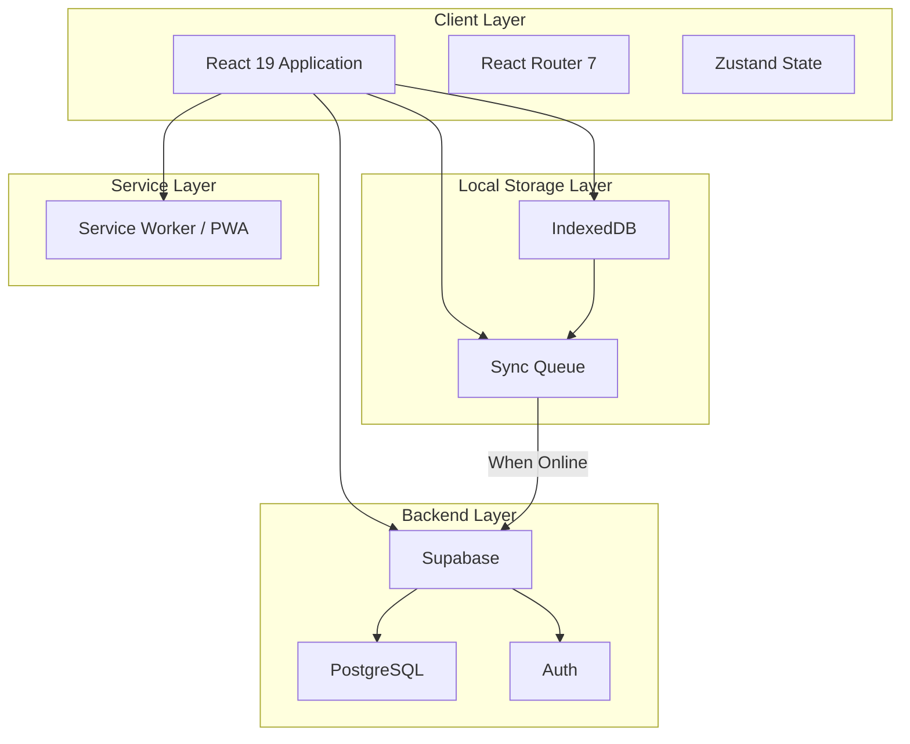
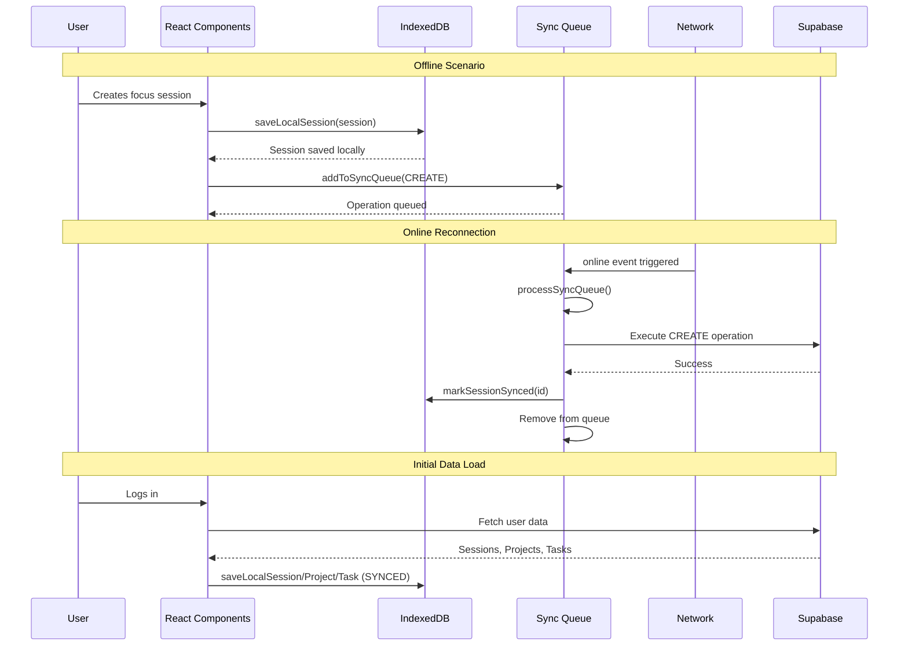
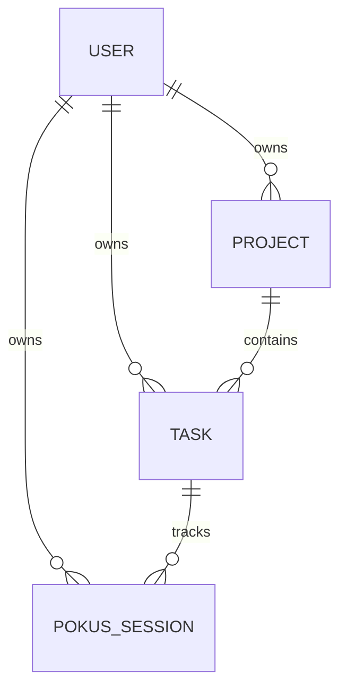

# Pokus Technical Documentation

## Table of Contents

1. [Overview](#overview)
2. [Architecture](#architecture)
3. [Technology Stack](#technology-stack)
4. [Project Structure](#project-structure)
5. [Offline-First Strategy](#offline-first-strategy)
   - [Core Principles](#core-principles)
   - [IndexedDB Schema](#indexeddb-schema)
   - [Sync Queue System](#sync-queue-system)
   - [Data Synchronization Flow](#data-synchronization-flow)
   - [Conflict Resolution](#conflict-resolution)
6. [PWA Implementation](#pwa-implementation)
7. [Data Models](#data-models)
8. [API Layer](#api-layer)
9. [Authentication](#authentication)
10. [Route Definitions](#route-definitions)
11. [Deployment](#deployment)

---

## Overview

Pokus is a distraction-free deep work environment designed to help users focus on meaningful tasks. The application combines a focus timer with project and task management, featuring robust offline-first capabilities that ensure uninterrupted productivity regardless of network conditions.

---

## Architecture



---

## Technology Stack

| Category | Technology | Version |
|----------|------------|---------|
| Frontend Framework | React | 19.2.3 |
| Routing | React Router | 7.1.2 |
| Build Tool | Vite | 6.0.5 |
| Language | TypeScript | 5.x |
| Styling | Tailwind CSS | 3.4.19 |
| UI Components | Radix UI | - |
| Icons | Lucide React | 0.562.0 |
| Local Database | IndexedDB (idb) | 8.0.3 |
| Backend | Supabase | 2.20.0 |
| PWA | vite-plugin-pwa | 1.2.0 |
| Notifications | Sonner | 2.0.7 |

---

## Project Structure

```
src/
├── api/
│   ├── auth.ts              # Authentication API & user data sync
│   ├── focus.ts             # Focus session operations
│   └── projects.ts          # Project & Task CRUD operations
├── components/
│   ├── features/
│   │   ├── CircularDurationInput.tsx
│   │   ├── TagSelector.tsx
│   │   └── timer.tsx
│   └── ui/
│       ├── button.tsx
│       ├── card.tsx
│       ├── input.tsx
│       ├── modal.tsx
│       └── sonner.tsx
├── contexts/
│   └── AuthContext.tsx     # Authentication state management
├── hooks/
│   └── useAuth.ts           # Authentication hook
├── lib/
│   ├── supabase/
│   │   └── client.ts        # Supabase client initialization
│   ├── sync/
│   │   ├── db.ts            # IndexedDB configuration & operations
│   │   ├── index.ts         # Sync module exports
│   │   ├── projectStore.ts  # Local project operations
│   │   ├── sessionStore.ts  # Local session operations
│   │   ├── syncQueue.ts     # Offline sync queue management
│   │   └── taskStore.ts     # Local task operations
│   └── authCache.ts         # User ID caching for offline auth
├── pages/
│   ├── DashboardPage.tsx
│   ├── FocusDetailPage.tsx
│   ├── FocusPage.tsx
│   ├── HomePage.tsx
│   ├── LoginPage.tsx
│   ├── ProjectDetailPage.tsx
│   └── ProjectsPage.tsx
├── styles/
│   └── globals.css
├── main.tsx                 # Application entry point
├── router.tsx               # Route definitions
└── vite-env.d.ts
```

---

## Offline-First Strategy

### Core Principles

The Pokus application follows a strict offline-first architecture with the following principles:

1. **Local-First Data Access**: All data operations initially target IndexedDB, providing instant responsiveness
2. **Queue-Based Synchronization**: Changes are queued locally and synced when connectivity is available
3. **Automatic Background Sync**: The sync queue processes automatically when the device goes online
4. **Guest User Support**: Unauthenticated users can use the timer while their sessions remain local
5. **Graceful Degradation**: The app remains fully functional without network connectivity

### IndexedDB Schema

The application uses IndexedDB (via the `idb` library) with version 5, containing four object stores:

```typescript
// Database: pokus-offline (Version 5)

interface PokusDB {
  // Sessions store - Focus sessions with sync status
  sessions: {
    key: string;
    value: LocalSession;
    indexes: {
      "by-sync-status": string;
      "by-created-at": string;
      "by-user-id": string;
    };
  };

  // Sync queue - Pending operations to sync
  syncQueue: {
    key: string;
    value: SyncOperation;
    indexes: {
      "by-next-retry": number;
    };
  };

  // Projects store - User projects
  projects: {
    key: string;
    value: LocalProject;
    indexes: {
      "by-user-id": string;
    };
  };

  // Tasks store - Project tasks
  tasks: {
    key: string;
    value: LocalTask;
    indexes: {
      "by-project-id": string;
      "by-user-id": string;
    };
  };
}
```

#### Local Session Model

```typescript
interface LocalSession {
  id: string;
  title: string;
  duration: number;
  status: "PLANNED" | "IN_PROGRESS" | "COMPLETED" | "ABANDONED";
  tags: string[];
  task_id?: string;
  started_at?: string;
  ended_at?: string;
  created_at: string;
  user_id: string;
  syncStatus: "SYNCED" | "PENDING" | "FAILED";
  lastSyncedAt?: string;
}
```

#### Sync Operation Model

```typescript
interface SyncOperation {
  id: string;
  type: "CREATE" | "UPDATE" | "DELETE";
  table: string;
  data: Record<string, unknown>;
  retryCount: number;
  nextRetryAt: number;
  createdAt: number;
}
```

### Sync Queue System

The sync queue implements a robust retry mechanism with exponential backoff:

```typescript
const MAX_RETRIES = 5;
const BASE_DELAY_MS = 1000;
const MAX_DELAY_MS = 30000;

function getBackoffDelay(retryCount: number): number {
  const delay = Math.min(BASE_DELAY_MS * Math.pow(2, retryCount), MAX_DELAY_MS);
  const jitter = delay * 0.1 * (Math.random() * 2 - 1);
  return Math.round(delay + jitter);
}
```

#### Key Features:

1. **Automatic Retry**: Failed operations are retried with exponential backoff
2. **Jitter Addition**: Random jitter prevents thundering herd on reconnection
3. **Network State Detection**: Sync pauses when offline, resumes when online
4. **Manual Force Sync**: Users can force sync all pending operations
5. **Per-Table Callbacks**: Special handling for session sync status updates

### Data Synchronization Flow



### Conflict Resolution

The application employs a **Last-Write-Wins** strategy with the following rules:

1. **Local Pending Wins**: Local changes marked as PENDING take precedence
2. **Remote SYNCED State**: Only remote data that was previously synced is preserved
3. **Weekly Data Window**: Sessions are fetched from the current week during sync
4. **Guest Mode**: Guest users (no authentication) have fully local data that never syncs

---

## PWA Implementation

The application is configured as a Progressive Web App using `vite-plugin-pwa`:

```typescript
// vite.config.ts
VitePWA({
  registerType: "autoUpdate",
  manifest: {
    name: "Pokus — Deep Work Timer",
    short_name: "Pokus",
    theme_color: "#0F172A",
    background_color: "#0F172A",
    display: "standalone",
    icons: [/* ... */],
  },
  workbox: {
    runtimeCaching: [
      // Google Fonts caching
      { urlPattern: /^https:\/\/fonts\.googleapis\.com\/.*/i, handler: "CacheFirst" },
      { urlPattern: /^https:\/\/fonts\.gstatic\.com\/.*/i, handler: "CacheFirst" },
    ],
  },
});
```

### PWA Features:

- **Auto-update**: Service worker updates automatically
- **Offline Asset Caching**: Fonts and static assets cached for offline use
- **Installable**: Users can install as a native app
- **Standalone Display**: Opens without browser chrome

---

## Data Models

### Database Schema (Supabase)



#### Projects Table

| Column | Type | Constraints |
|--------|------|-------------|
| id | UUID | PRIMARY KEY, DEFAULT gen_random_uuid() |
| user_id | UUID | REFERENCES auth.users(id), NOT NULL |
| name | VARCHAR(255) | NOT NULL |
| description | TEXT | DEFAULT '' |
| created_at | TIMESTAMP WITH TIME ZONE | DEFAULT NOW() |
| updated_at | TIMESTAMP WITH TIME ZONE | DEFAULT NOW() |

#### Tasks Table

| Column | Type | Constraints |
|--------|------|-------------|
| id | UUID | PRIMARY KEY |
| user_id | UUID | REFERENCES auth.users(id) |
| project_id | UUID | REFERENCES projects(id) |
| title | VARCHAR(255) | NOT NULL |
| description | TEXT | DEFAULT '' |
| duration_minutes | INTEGER | DEFAULT 0 |
| is_completed | BOOLEAN | DEFAULT FALSE |
| completed_at | TIMESTAMP WITH TIME ZONE | NULLABLE |
| created_at | TIMESTAMP WITH TIME ZONE | DEFAULT NOW() |
| updated_at | TIMESTAMP WITH TIME ZONE | DEFAULT NOW() |

#### Pokus Sessions Table

| Column | Type | Constraints |
|--------|------|-------------|
| id | UUID | PRIMARY KEY |
| user_id | UUID | REFERENCES auth.users(id) |
| task_id | UUID | REFERENCES tasks(id), NULLABLE |
| title | VARCHAR(255) | NOT NULL |
| duration | INTEGER | NOT NULL |
| status | VARCHAR(50) | NOT NULL |
| tag | VARCHAR(100) | NULLABLE |
| started_at | TIMESTAMP WITH TIME ZONE | NULLABLE |
| ended_at | TIMESTAMP WITH TIME ZONE | NULLABLE |
| created_at | TIMESTAMP WITH TIME ZONE | DEFAULT NOW() |

---

## API Layer

### Authentication API (`src/api/auth.ts`)

```typescript
// User data synchronization on login
async function loginWithEmail(email: string, password: string) {
  // 1. Authenticate with Supabase
  // 2. Clear local IndexedDB
  // 3. Sync all user data from server
}

async function syncAllUserData(userId: string) {
  // Parallel sync of sessions, projects, and tasks
  await Promise.all([
    populateUserSessions(userId),
    populateUserProjects(userId),
    populateUserTasks(userId),
  ]);
}
```

### Focus Session API (`src/api/focus.ts`)

```typescript
// Create session - stored locally first
async function createSession(
  title: string,
  duration: number,
  tags: string[] = [],
  taskId?: string,
): Promise<LocalSession>

// Update session status
async function updateSessionStatus(
  sessionId: string,
  status: "COMPLETED" | "ABANDONED",
  actualDuration?: number,
): Promise<void>

// Get sessions with date range filtering
async function getSessions(
  startDate: Date,
  endDate: Date,
): Promise<LocalSession[]>
```

---

## Authentication

### Auth Flow

1. **Initialization**: On app load, `AuthContext` checks for existing session
2. **State Change Listener**: Supabase auth state changes trigger data sync
3. **Guest Mode**: Unauthenticated users get a unique guest ID (`guest`)
4. **Login/Signup**: Clears local data and syncs user's cloud data

### Auth Caching (`src/lib/authCache.ts`)

To support offline authentication checks:

```typescript
let cachedUserId: string | null = null;

export function getCachedUserId(): string | null
export function setCachedUserId(userId: string | null): void
export async function getUserIdFromCache(): Promise<string | null>
```

---

## Route Definitions

| Path | Component | Access | Description |
|------|-----------|--------|-------------|
| `/` | HomePage | Public | Landing page |
| `/login` | LoginPage | Public | Login/Register |
| `/focus` | FocusPage | Public | Timer setup |
| `/focus/:id` | FocusDetailPage | Public | Active timer |
| `/projects` | ProjectsPage | Authenticated | Projects list |
| `/projects/:id` | ProjectDetailPage | Authenticated | Project with tasks |
| `/history` | DashboardPage | Authenticated | Session history |

---

## Deployment

### Vercel (Recommended)

```bash
npm i -g vercel
vercel
```

Environment variables required:
- `VITE_SUPABASE_URL`
- `VITE_SUPABASE_ANON_KEY`

### Build Commands

```bash
npm run dev      # Development server (port 3000)
npm run build    # Production build
npm run preview  # Preview production build
npm run lint     # ESLint check
```

---

## Key Implementation Details

### 1. Service Worker Registration

```typescript
// main.tsx
import { registerSW } from "virtual:pwa-register";

registerSW({ immediate: true });
```

### 2. Sync Queue Initialization

```typescript
// main.tsx
import { initSyncQueue } from "@/lib/sync";

initSyncQueue();

// In syncQueue.ts - handles online/offline events
export function initSyncQueue(): void {
  window.addEventListener("online", () => {
    processSyncQueue();
  });

  window.addEventListener("offline", () => {
    // Pause sync
  });
}
```

### 3. Initial Data Sync on Login

```typescript
// AuthContext.tsx
useEffect(() => {
  supabase.auth.onAuthStateChange((_event, session) => {
    if (session?.user?.id !== previousUserId.current) {
      syncAllUserData(session.user.id);
    }
  });
}, []);
```

---

## License

MIT
